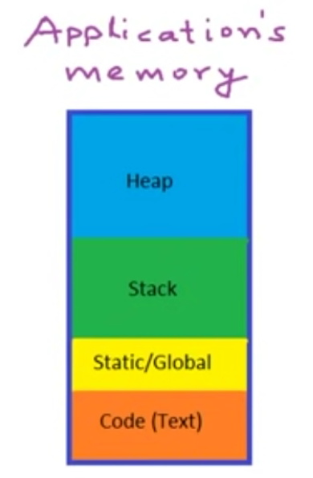
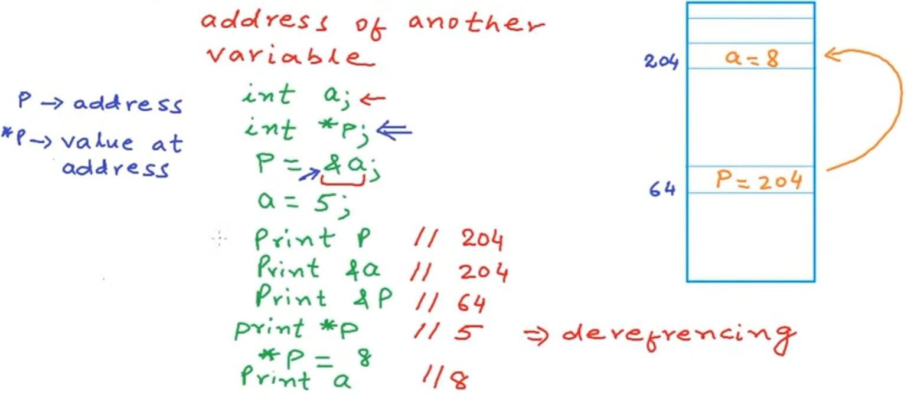
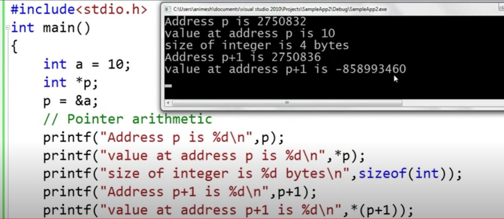
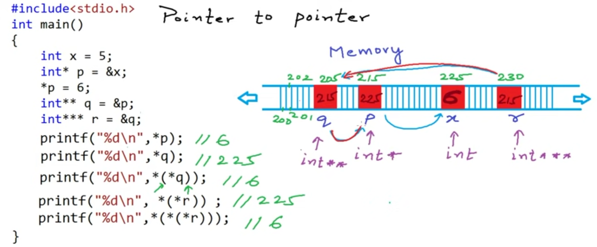
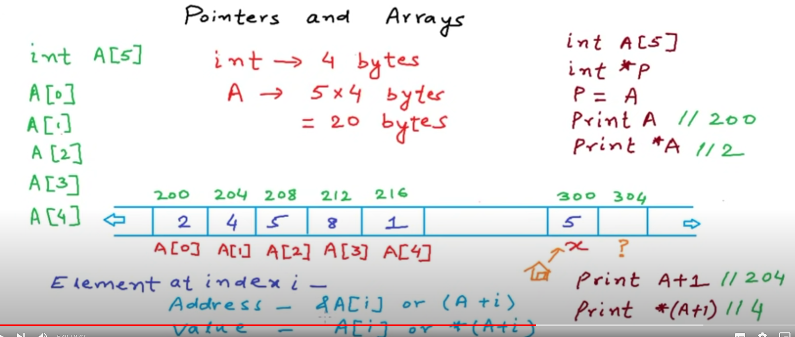
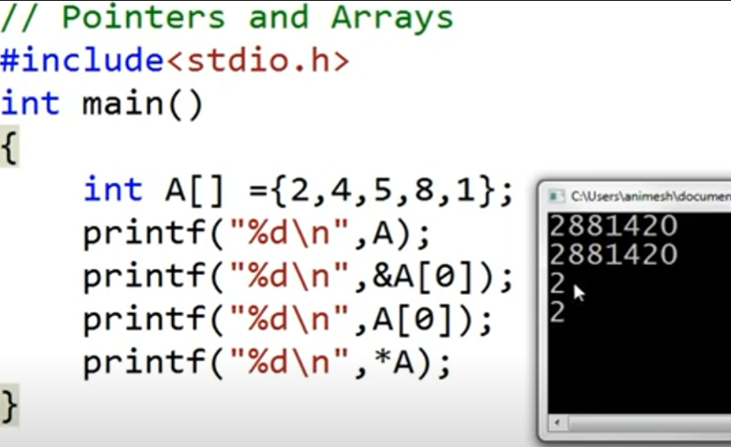
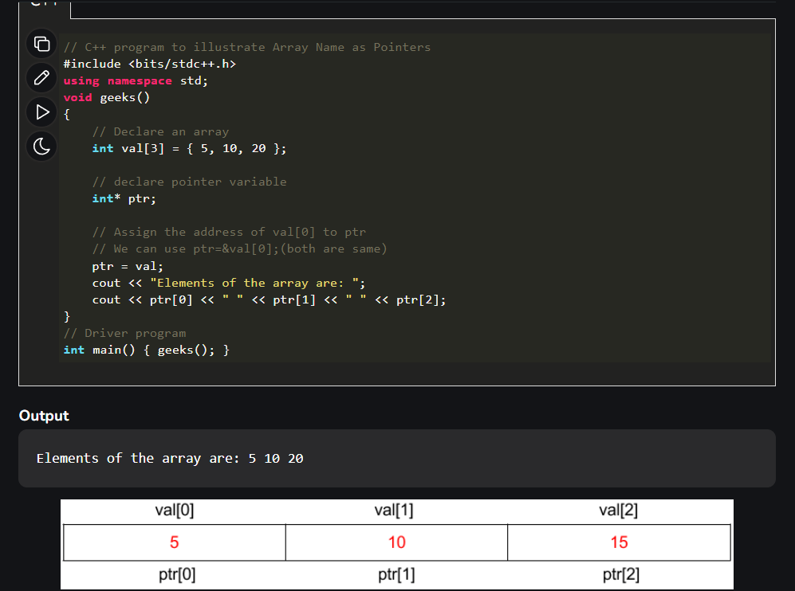
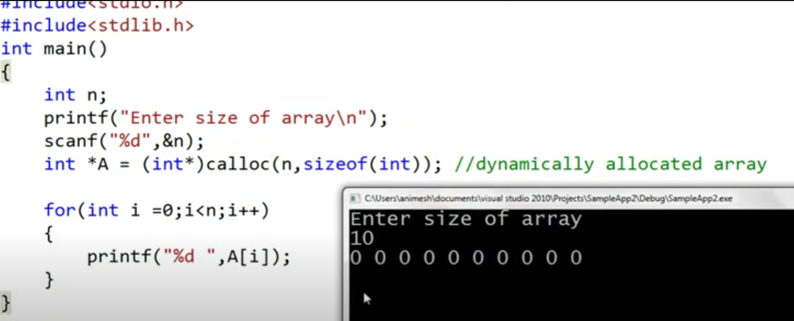
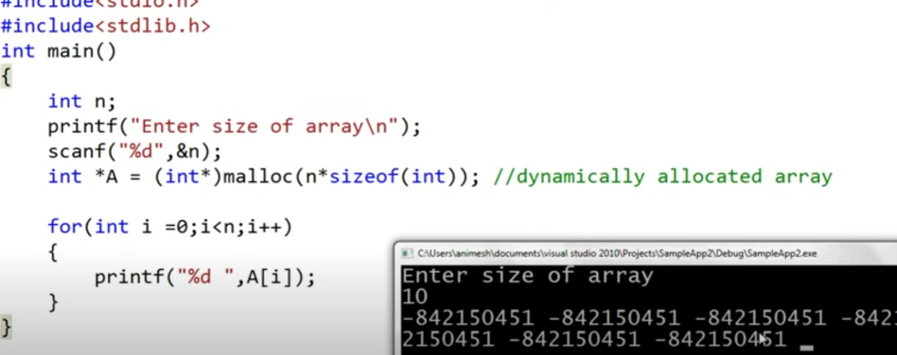

# Pointers are vaiables that store address fo another vaiable



Pointer is used for dereferecing the objects

```
    #include <bits/stdc++.h>
    using namespace std;

    int main(){

    }
```

Here p stores the address of a

important to note

we do not have Value at address p+1 so therefore garbage value is shown

### Pointers to pointer



### Pointers and Arrays




Both A and A[0] gives the address of first element.



---

### Dynamic memeory allocation

[Gfg article](https://www.geeksforgeeks.org/dynamic-memory-allocation-in-c-using-malloc-calloc-free-and-realloc/)

- malloc
- calloc
- free
- realloc

- new() and delete are used in c++

Difference between malloc and calloc is in synatax and one more difference is that calloc intialised the values with 0 , while malloc gives garbage value
 
